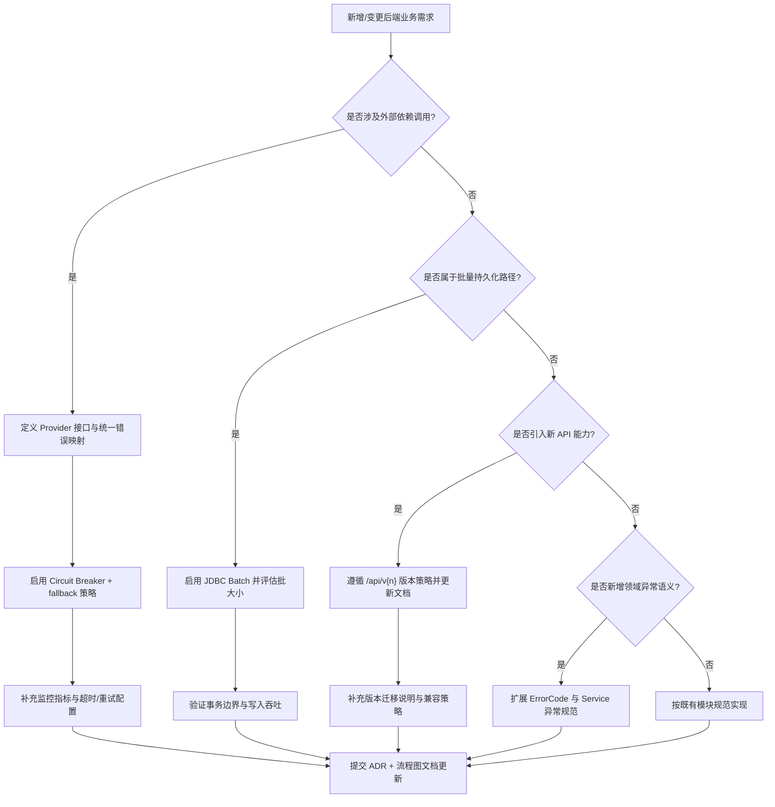
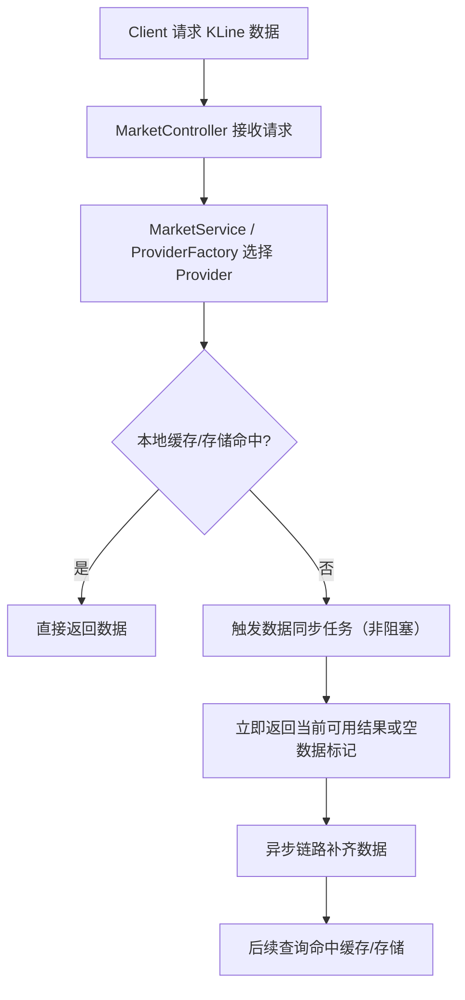
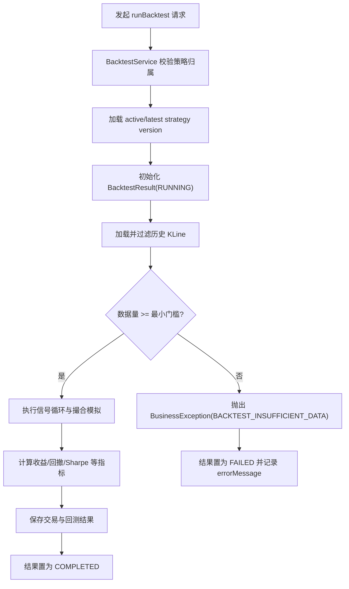
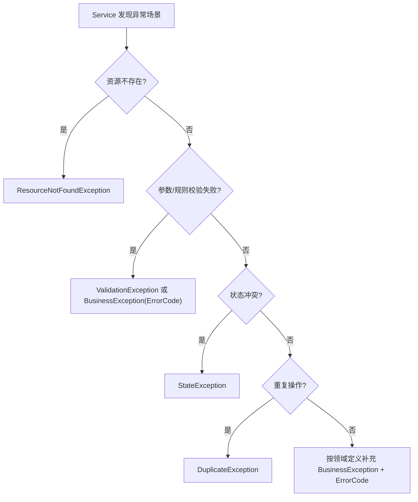

# Architecture Decision Tree & Key Business Flows

本文档提供关键业务路径的可视化说明，作为代码阅读与架构评审的快速入口。

## 1. 架构决策树（后端业务变更）

## 2. 关键流程图：KLine 查询与同步触发

## 3. 关键流程图：回测执行链路

## 4. 关键流程图：Service 异常规范映射

## 5. 维护约定

- 当关键业务路径发生明显调整时，必须同步更新本文件对应流程图。
- 涉及架构策略变化时，需新增或更新 ADR，并在 `docs/README.md` 建立索引入口。
- 流程图应优先描述“职责边界 + 决策节点 + 异常路径”，避免落入实现细节。
