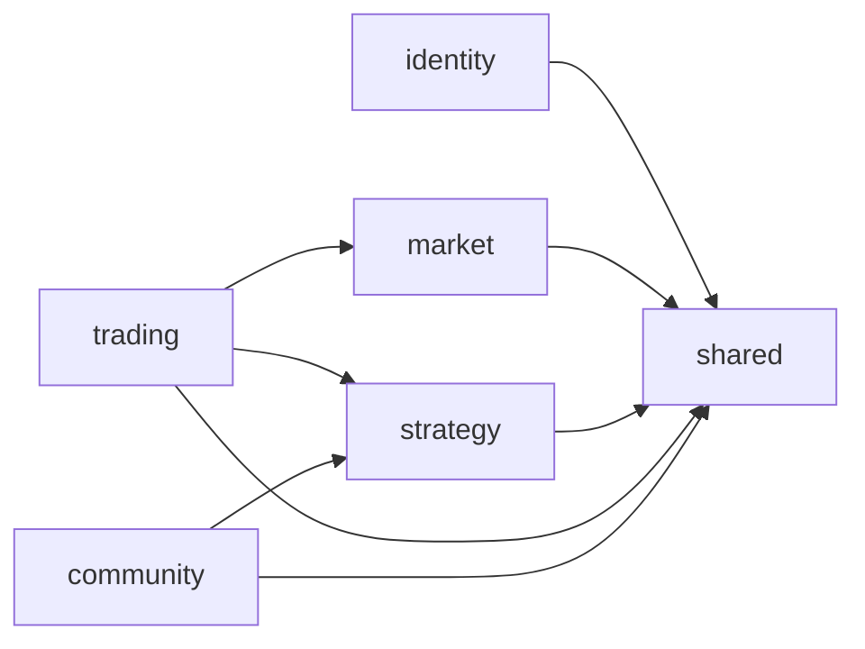

# Domain Model Design (DDD)

本文档定义后端按业务领域拆分模块的设计基线，目标是降低耦合、提升演进效率与团队协作清晰度。

## 1. Bounded Context 划分

建议按以下核心领域拆分：

- `market`：市场行情与指标计算（KLine、指标聚合、Provider 协调）
- `strategy`：策略定义、版本管理、参数模板
- `trading`：回测、交易信号、订单执行与持仓语义
- `community`：社区信号、互动行为（点赞/收藏/订阅）
- `identity`：用户、认证授权、租户与安全策略
- `shared`：跨领域通用能力（错误模型、时间/金额值对象、通用事件）

## 2. 领域职责与聚合建议

### market

- 聚合建议：`MarketSnapshot`, `KlineSeries`, `IndicatorSet`
- 领域服务：`MarketDataSyncService`, `IndicatorComputationService`
- 核心规则：Provider 错误语义统一映射到业务异常，不向上泄露第三方细节

### strategy

- 聚合建议：`Strategy`, `StrategyVersion`, `StrategyParamSchema`
- 领域服务：`StrategyVersioningService`
- 核心规则：策略版本不可回写历史；激活版本切换必须可审计

### trading

- 聚合建议：`BacktestRun`, `BacktestTrade`, `ExecutionOrder`, `Position`
- 领域服务：`BacktestDomainService`, `ExecutionRiskService`
- 核心规则：交易状态流转显式建模，禁止跨层直接改状态字段

### community

- 聚合建议：`CommunitySignal`, `SignalInteraction`, `SignalSubscription`
- 领域服务：`SignalInteractionService`
- 核心规则：交互幂等（重复点赞/收藏/订阅语义一致）

### identity

- 聚合建议：`UserAccount`, `RoleBinding`, `CredentialPolicy`
- 领域服务：`AuthenticationPolicyService`, `AuthorizationPolicyService`
- 核心规则：鉴权策略集中，不在业务领域重复硬编码权限判断

## 3. 跨领域协作规则

- 只允许通过 `application service` 或领域事件跨上下文协作，禁止直接引用他域 repository。
- `market -> trading`：仅通过只读数据契约（行情/指标 DTO）交互。
- `strategy -> trading`：通过已发布的策略版本快照交互，避免运行时读取可变草稿。
- `identity -> *`：以鉴权上下文注入，不反向依赖业务领域。
- `community` 与 `trading/strategy`：通过 ID 与投影数据解耦，不共享可变聚合对象。

## 4. 模块依赖约束



约束说明：

- `shared` 只能依赖基础库，不依赖业务模块；
- `trading` 可读依赖 `market` 与 `strategy` 的公开契约；
- 禁止反向依赖：`market/strategy/community` 不依赖 `trading` 内部实现。

## 5. 推荐包结构（示意）

```text
com.koduck
├── market
│   ├── domain
│   ├── application
│   ├── infrastructure
│   └── interfaces
├── strategy
├── trading
├── community
├── identity
└── shared
```

## 6. 渐进式落地策略

1. 先文档化边界：新增/改造需求先标注所属 bounded context。
2. 再收敛依赖：禁止新增跨域 repository 直连。
3. 最后结构迁移：按模块逐步拆分 package 与 service。

## 7. 评审清单

- 是否明确归属单一领域？
- 是否引入了不必要的跨域依赖？
- 是否复用了 `shared` 中的值对象与异常语义？
- 变更是否需要补 ADR（新增上下文、重大边界调整、跨域契约变更）？

## 8. 实施状态（Phase 1 + Phase 2）

已完成从 `com.koduck.service.impl` 到领域 `application` 包的迁移：

- `identity.application`：
  `AuthServiceImpl`, `CredentialServiceImpl`, `ProfileServiceImpl`, `UserServiceImpl`,
  `UserCacheServiceImpl`, `UserSettingsServiceImpl`
- `market.application`：
  `MarketServiceImpl`, `KlineServiceImpl`, `KlineMinutesServiceImpl`, `KlineSyncServiceImpl`,
  `TechnicalIndicatorServiceImpl`, `WatchlistServiceImpl`, `MarketBreadthServiceImpl`,
  `MarketFlowServiceImpl`, `MarketSectorNetFlowServiceImpl`, `MarketSentimentServiceImpl`,
  `PricePushServiceImpl`, `StockCacheServiceImpl`, `StockSubscriptionServiceImpl`,
  `SyntheticTickServiceImpl`, `TickStreamServiceImpl`
- `strategy.application`：
  `StrategyServiceImpl`
- `trading.application`：
  `BacktestServiceImpl`, `PortfolioServiceImpl`
- `community.application`：
  `CommunitySignalServiceImpl`
- `shared.application`：
  `AiAnalysisServiceImpl`, `EmailServiceImpl`, `MemoryServiceImpl`,
  `MonitoringServiceImpl`, `RateLimiterServiceImpl`

当前状态：

- `com.koduck.service.impl` 已不再承载业务实现类；
- 领域模块边界已在代码结构中完整体现。
