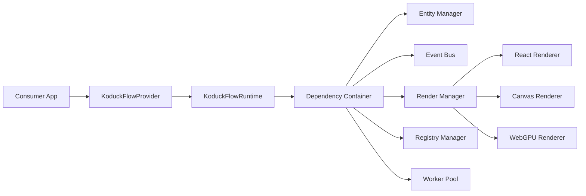

# Koduck-Flow 设计总览

> 范围：runtime、DI、event、render、worker、plugin、decorator/capability 的职责边界。

## Runtime 结构

Koduck-Flow 当前更接近 TypeScript 流程引擎与 React 组件库。运行时通过 DI 容器管理跨模块服务，并向调用方提供较小的 facade。

## 核心边界

| 区域 | 职责 | 应避免 |
|------|----------------|--------------|
| `common/runtime` | Runtime facade、租户上下文、manager 协调 | 渲染细节和组件状态 |
| `common/di` | 服务注册、scope、生命周期 | 领域业务行为 |
| `common/event` | 监听器注册、批处理、去重、异步分发 | 事件触发后的业务决策 |
| `common/flow` | 节点、边、图操作、遍历 | 纯 UI 布局行为 |
| `common/render` | 渲染器选择与渲染编排 | 在渲染状态外直接修改实体 |
| `common/worker-pool` | 后台任务调度与 worker 生命周期 | UI 回调和 React 状态 |
| `common/plugin` | 沙箱执行与插件生命周期 | 不受限的宿主访问 |
| `utils/decorator` | capability 发现与执行辅助 | 成为扩展运行时行为的唯一入口 |

## 事件失败语义

事件分发把监听器视为相互隔离的订阅者。单个监听器失败时，应记录和计数，但不能阻止其他监听器继续执行。若某些 batch 或 worker API 的契约明确表示“一个整体操作”，仍可保留 fail-fast 语义。

## 图查询语义

遍历操作应优先使用图索引。successor 查询使用 child links，predecessor 查询使用 graph parent index；扫描全量节点只应出现在 connected components 这类全图算法中。

## Capability 系统边界

decorator/capability 子系统是围绕 provider、cache、executor、manager 和集成工具构建的便利层。公共调用方应依赖导出的接口和 manager facade，内部实现按职责拆分：

| 层级 | 职责 |
|-------|------|
| Provider | 存储已注册 capability，并回答可用性查询 |
| Cache | 使用 TTL 和指标缓存 capability lookup |
| Executor | 执行一个或多个 capability，支持 timeout/retry |
| Manager | 编排 provider/cache/executor，并提供报告 |
| Utils | 提供 entity/container 兼容性辅助函数 |

新增行为应优先落在最窄的职责层。Manager 应保持 facade 定位，而不是承接所有实现细节。
